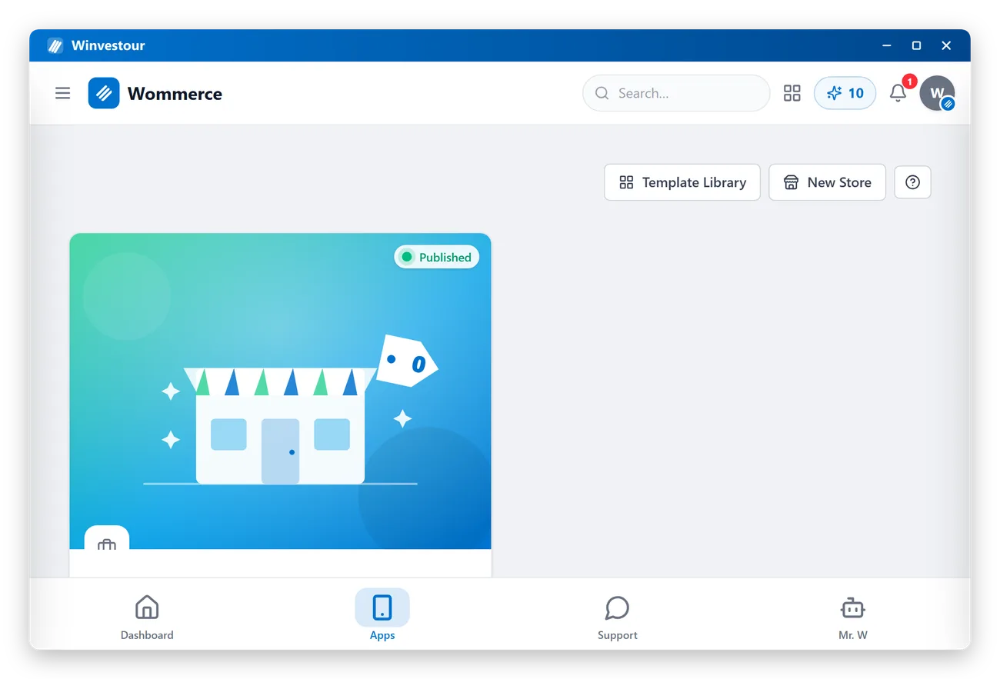
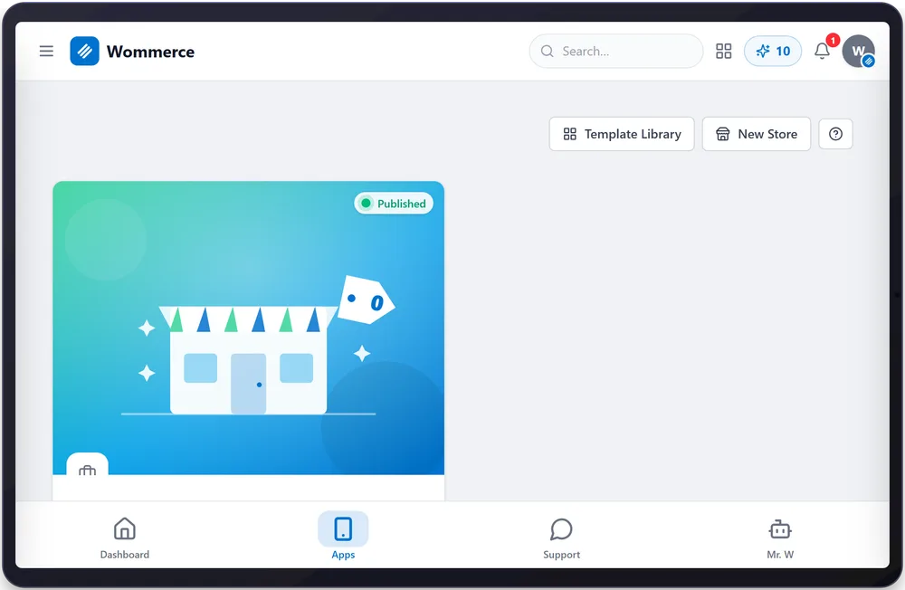
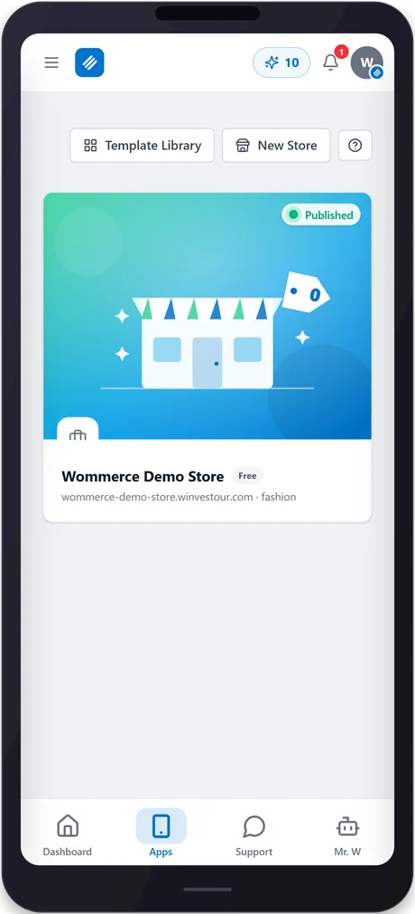
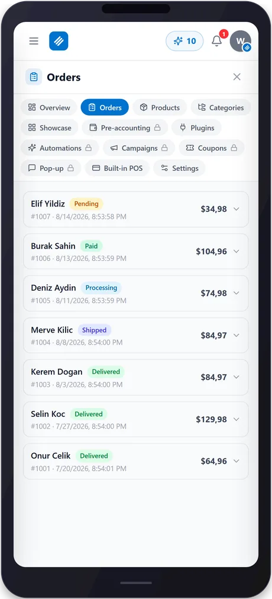

<div align="center">
  
</div>

# Winvestour Desktop

The native desktop shell for [Winvestour](https://www.winvestour.com/winvestour) — your whole business in one free app: online store (Wommerce), social media automation (Wocial), influencer (Winfluencers) and reseller (Wellers) programs under one account. Built with [Tauri v2](https://tauri.app): a small, native window (~2 MB) that opens the live Winvestour web app.

**Download the latest release:** see the [Releases](https://github.com/Winvestour/winvestour/releases) page for Windows and Linux builds.

<div align="center">

<a href="https://github.com/Winvestour/winvestour/releases/latest"></a>
<a href="https://github.com/Winvestour/winvestour/releases"></a>

<a href="LICENSE"></a>

<a href="https://github.com/Winvestour/winvestour/releases/latest"></a>&nbsp;
<a href="https://github.com/Winvestour/winvestour/releases/latest"></a>

<a href="https://www.winvestour.com/winvestour"><b>Website</b></a> · <a href="https://www.winvestour.com/register"><b>Create a free account</b></a> · <a href="https://github.com/Winvestour"><b>All Winvestour apps</b></a>


<sub>Your whole business in one free app — store, social media, influencer and reseller programs under one account.</sub>

</div>


## What this is

This shell contains **no application logic** — it's a thin native window around `https://www.winvestour.com`. All of Winvestour's actual functionality (store builder, social media AI, influencer and reseller programs, payments) lives on the web and is identical across platforms; this repo only ships the native wrapper (window chrome, tray behavior, auto-sizing) so Winvestour installs and feels like a real desktop app.

- Branded title bar (frameless window, blue, drag-to-move)
- Single-instance (opening a second time focuses the existing window)
- Window size/position remembered between launches
- No telemetry, no bundled secrets, no local data storage beyond what the browser session already does

## Screenshots

<div align="center">
&nbsp;

<br><br>
&nbsp;
&nbsp;

<br><br>
<a href="https://www.winvestour.com/winvestour/screenshots">See all screenshots →</a>
</div>

## Building locally

Prerequisites: [Rust](https://rustup.rs) (stable, MSVC toolchain on Windows), [Node.js](https://nodejs.org) 20+, and platform build tools ([Tauri prerequisites](https://tauri.app/start/prerequisites/)).

```bash
npm install
npm run tauri build
```

Output installers land in `src-tauri/target/release/bundle/`.

## Supported platforms

| Platform | Format | Status |
|---|---|---|
| Windows 10/11 | `.exe` (NSIS), `.msi` | ✅ |
| Linux | `.deb`, `.rpm`, `.AppImage` | ✅ (built via CI) |
| macOS | — | Not planned |

## License

MIT — see [LICENSE](LICENSE).
