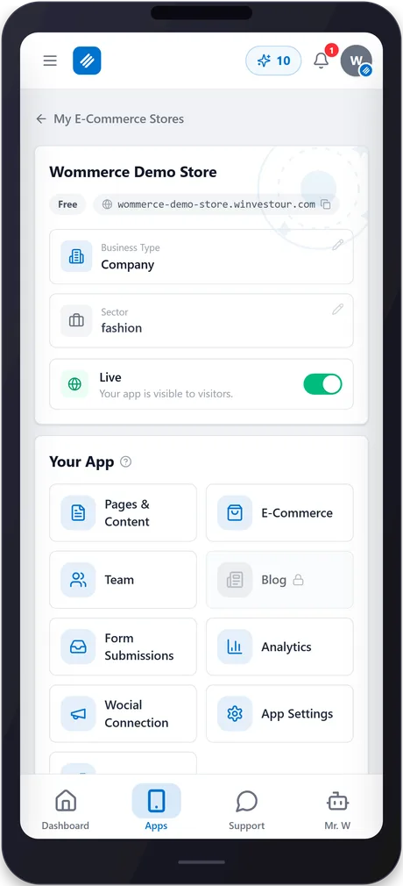

<div align="center">
  
</div>

# Winvestour Desktop

The native desktop shell for [Winvestour](https://www.winvestour.com/winvestour) — your whole business in one free app: online store (Wommerce), social media automation (Wocial), influencer (Winfluencers) and reseller (Wellers) programs under one account. Built with [Tauri v2](https://tauri.app): a small, native window (~2 MB) that opens the live Winvestour web app.

**Download the latest release:** see the [Releases](https://github.com/Winvestour/winvestour/releases) page for Windows and Linux builds.

<div align="center">

<a href="https://github.com/Winvestour/winvestour/releases/latest"></a>
<a href="https://github.com/Winvestour/winvestour/releases"></a>

<a href="LICENSE"></a>

<a href="https://github.com/Winvestour/winvestour/releases/latest"></a>&nbsp;
<a href="https://github.com/Winvestour/winvestour/releases/latest"></a>

<a href="https://www.winvestour.com/winvestour"><b>Website</b></a> · <a href="https://www.winvestour.com/register"><b>Create a free account</b></a> · <a href="https://github.com/Winvestour"><b>All Winvestour apps</b></a>


<sub>Your whole business in one free app — store, social media, influencer and reseller programs under one account.</sub>

</div>


## What this is

This shell contains **no application logic** — it's a thin native window around `https://www.winvestour.com`. All of Winvestour's actual functionality (store builder, social media AI, influencer and reseller programs, payments) lives on the web and is identical across platforms; this repo only ships the native wrapper (window chrome, tray behavior, auto-sizing) so Winvestour installs and feels like a real desktop app.

- Branded title bar (frameless window, blue, drag-to-move)
- Single-instance (opening a second time focuses the existing window)
- Window size/position remembered between launches
- No telemetry, no bundled secrets, no local data storage beyond what the browser session already does

## Highlights

| | | |
|---|---|---|
| ✨ **AI everywhere — text, images, logos, video and site design inside the app** | 🌐 **33 languages — the app and your store open in your customer’s language** | 🔗 **Your own domain — buy one or connect an existing one; hosting included** |
| 💳 **Secure payments — card details never reach our servers; Stripe processes them** | 🧩 **One panel — all four products under one account; switch anytime** | 🛡️ **Your data stays yours — delete your account or export your data anytime** |

## Screenshots

<div align="center">
&nbsp;
&nbsp;
&nbsp;

<br><br>
<a href="https://www.winvestour.com/winvestour/screenshots">See all screenshots →</a>
</div>

## Building locally

Prerequisites: [Rust](https://rustup.rs) (stable, MSVC toolchain on Windows), [Node.js](https://nodejs.org) 20+, and platform build tools ([Tauri prerequisites](https://tauri.app/start/prerequisites/)).

```bash
npm install
npm run tauri build
```

Output installers land in `src-tauri/target/release/bundle/`.

## Supported platforms

| Platform | Format | Status |
|---|---|---|
| Windows 10/11 | `.exe` (NSIS), `.msi` | ✅ |
| Linux | `.deb`, `.rpm`, `.AppImage` | ✅ (built via CI) |
| macOS | — | Not planned |

## Frequently asked questions

<details><summary><b>What does the Winvestour app do?</b></summary><br>
Winvestour lets you run your entire business from one app: your online store, your social media posting, your reseller and influencer earnings, plus hosting and domains all live in the same account.
</details>

<details><summary><b>Do I have to use the five products separately?</b></summary><br>
No. One free Winvestour account gives you access to Wommerce, Wocial, Winfluencers and Wellers. Use the ones you need and simply never open the rest.
</details>

<details><summary><b>Which devices does it work on?</b></summary><br>
It runs on Android phones and tablets, on Windows computers and in the web browser. Sign in with the same account on all three and your data stays in sync everywhere.
</details>

<details><summary><b>Does an account cost anything?</b></summary><br>
No. A Winvestour account is free and needs no credit card. You can build your store on the free-forever plan; you only pay when you add a premium feature or service.
</details>

<details><summary><b>Can I buy hosting and a domain too?</b></summary><br>
Yes. Domain registration and hosting are purchased from the same dashboard, and renewals are tracked there as well. You never have to manage a server yourself.
</details>

<details><summary><b>How many languages is it available in?</b></summary><br>
The app is available in 33 languages and fully supports right-to-left scripts. You pick your language in account settings; your store's language is configured separately.
</details>

More answers on the [Winvestour website](https://www.winvestour.com/winvestour) and the [Winvestour organization page](https://github.com/Winvestour).

## More from Winvestour

One free account gives you all Winvestour apps.

<table><tr>
<td align="center" width="25%"><a href="https://github.com/Winvestour/wommerce"><br><b>Wommerce</b></a><br><sub><a href="https://www.winvestour.com/wommerce">Website</a></sub></td>
<td align="center" width="25%"><a href="https://github.com/Winvestour/wocial"><br><b>Wocial</b></a><br><sub><a href="https://www.winvestour.com/wocial">Website</a></sub></td>
<td align="center" width="25%"><a href="https://github.com/Winvestour/winfluencers"><br><b>Winfluencers</b></a><br><sub><a href="https://www.winvestour.com/winfluencers">Website</a></sub></td>
<td align="center" width="25%"><a href="https://github.com/Winvestour/wellers"><br><b>Wellers</b></a><br><sub><a href="https://www.winvestour.com/wellers">Website</a></sub></td>
</tr></table>

<div align="center">

### Winvestour is free. Start today.

Creating an account and using the app is free. You only pay for the paid services you actually use.

<a href="https://www.winvestour.com/register"></a>&nbsp;
<a href="https://github.com/Winvestour/winvestour/releases/latest"></a>

[Website](https://www.winvestour.com) · [About](https://www.winvestour.com/about) · [Blog](https://www.winvestour.com/blog) · [Contact](https://www.winvestour.com/contact) · [Privacy](https://www.winvestour.com/privacy) · [Terms](https://www.winvestour.com/terms)

[X](https://x.com/winvestour) · [Instagram](https://instagram.com/winvestour) · [LinkedIn](https://www.linkedin.com/in/winvestour-llc-940a6641b/) · [YouTube](https://www.youtube.com/@Winvestour) · [info@winvestour.com](mailto:info@winvestour.com)

</div>

## License

MIT — see [LICENSE](LICENSE).
